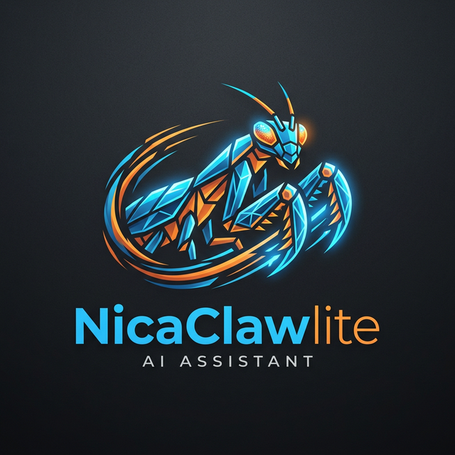

<div align="center">
  

  <h1>NicaClaw-lite</h1>
  <p><b>Ultra-Lightweight · Multi-API · AI-Bootstrapped Agent</b></p>

  <p>
    
    
    
    
  </p>

  <p>
    <a href="./INSTALL.md"><b>Installation Guide</b></a> •
    <a href="https://discord.gg/V4sAZ9XWpN"><b>Discord</b></a> •
    <a href="https://github.com/WilberGV/NicaClaw"><b>GitHub</b></a>
  </p>
</div>

---

**NicaClaw-lite** is the world's most efficient AI agent. Derived from the groundbreaking [nicaclaw](https://github.com/HKUDS/nicaclaw) architecture, the **lite** version is refactored from the ground up in Go to run on almost anything—from a $10 RISC-V board to your decade-old Android phone.

### ⚡️ Why NicaClaw-lite?

| Feature | NicaClaw-lite | Others |
| :--- | :--- | :--- |
| **Memory** | **< 10 MB** | > 1 GB |
| **Startup** | **< 1 Second** | > 30 Seconds |
| **Hardware** | **$10 Boards / Old Phones** | High-end PCs / Cloud |
| **Binary** | **Single File (No Deps)** | Complex Runtimes |

---

## 🚀 Core Features

- 🪶 **Ultra-Lite**: 99% less memory footprint than conventional agents.
- 🧪 **Multi-API Engine**: Native support for OpenRouter, Gemini, Anthropic, OpenAI, and more.
- 🔄 **Auto-Fallback**: If one API key fails or hits limits, it automatically switches to the next configured agent.
- ⚖️ **Load Balancing**: Distribute requests across multiple endpoints for maximum reliability.
- 🌍 **Cross-Platform**: Runs natively on Windows, Linux (x86/ARM/RISC-V/ARM64), and **Android (Termux)**.
- 🐜 **SIMD Optimized**: High-performance AVX2/SIMD code for fast local processing.
- 🛠 **System Tools API**: Execute system commands and access local files right from your chat prompt.

---

## 📱 Running on Android (Termux)

NicaClaw-lite is specifically designed with extreme portability in mind. You can run it locally on your smartphone using Termux.

```bash
# 1. Download the ARM64 binary
wget https://github.com/WilberGV/NicaClaw/releases/latest/download/nicaclaw-lite-linux-arm64

# 2. Make it executable
chmod +x nicaclaw-lite-linux-arm64

# 3. Quick setup & run
termux-chroot ./nicaclaw-lite-linux-arm64 onboard
```

For detailed platform-specific steps, see the [Full Installation Guide](./INSTALL.md).

---

## 🛠️ Multi-API & Fallback Engine

Stop worrying about rate limits or invalid keys. NicaClaw-lite's advanced registry allows you to stack unlimited providers.

```json
"model_list": [
  {
    "model_name": "gemini-flash",
    "model": "google/models/gemini-flash-latest",
    "api_key": "AIzaSy..." 
  },
  {
    "model_name": "gemini-flash",
    "model": "google/models/gemini-flash-latest",
    "api_key": "AIzaSy_SECONDARY..."
  }
]
```
If the primary key fails, NicaClaw-lite **instantly recovers** using the fallback agent without interrupting your workflow.

---

## 📦 Quick Start (Windows / Linux)

### 1. Install
Download the binary for your platform from [Releases](https://github.com/WilberGV/NicaClaw/releases) or see the [INSTALL.md](./INSTALL.md).

### 2. Onboard
```bash
nicaclaw-lite onboard
```

### 3. Configure
Add your API keys to `~/.nicaclaw-lite/config.json`.
> **Pro Tip**: Use [OpenRouter](https://openrouter.ai/keys) to access any model with one key.

### 4. Chat
```bash
nicaclaw-lite agent -m "Optimize this Go function for memory"
```

---

## 💬 Connect Your Apps
Talk to your agent through your favorite platforms:
- **Telegram**: `nicaclaw-lite gateway` (Check config for token)
- **Discord**: Full bot support with command handling.
- **Termux**: Running natively on Android.

---

## 🛡️ Security Sandbox
NicaClaw-lite prioritizes your safety. By default, it operates in a strict workspace sandbox:
- **Restricted access**: Only files within the `workspace` can be read or written.
- **Dangerous command protection**: Built-in guards against accidental system damage.

---

## 🤝 Community & Roadmap
We are building the future of edge AI. 
- [Roadmap](./docs/ROADMAP.md)

**Maintainer**: [WilberGV](https://github.com/WilberGV)